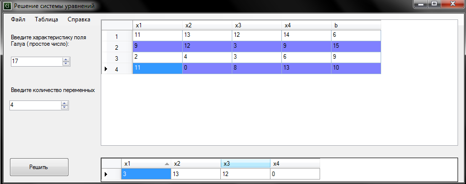

This repo contains set of two programs, one program solves linear equations in prime Galois fields using iterative methods, and the other one provides UI for input and yields solution to the user, using .NET and C# development tools.

Here's an example of how it works:

It was my early thesis in HSE in 2014.
